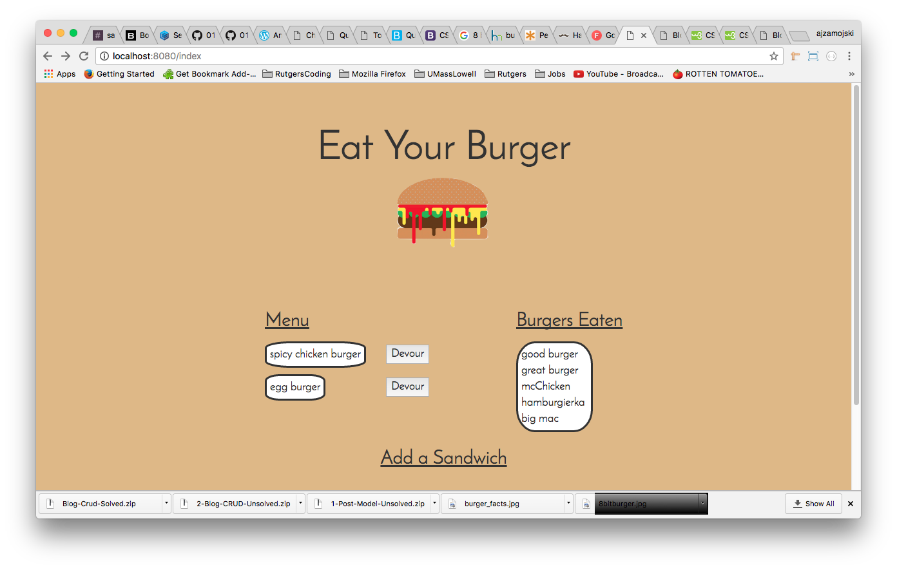

# burger

## Description
The burger app will allow users to enter burger information which
will create a burger list in mysql database and display the 
information to the user in the “Menu” section. Each burger will
also have a button that will allow the user, when clicked, to
be taken to the “Eaten” section. Home Page Example:

## How it works
The app uses express routing and mysql database to update the
burger objects and retrieve the information to the user. When
a burger is inputed, it is first created in mysql table and then
the sql table is retrieved and displayed to the user. Each burger
has a “devour” button which sends a request to mysql using javascript
and routing to update the database.

## Technologies Used
`HTML`, `Javascript`, `CSS`, `mysql`, `express`, `node`, `handlebars`